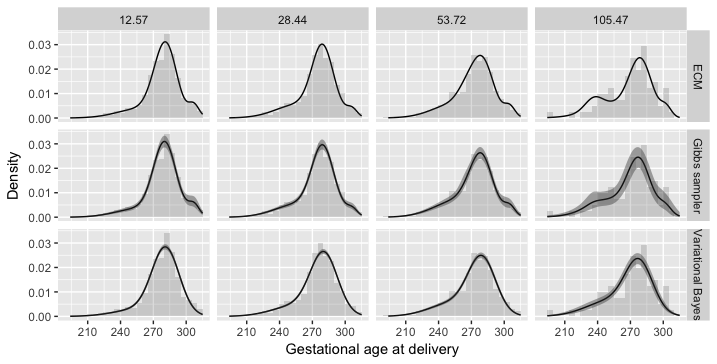
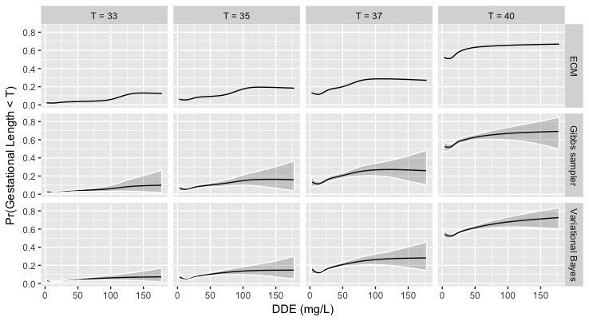

In this tutorial we describe the steps for obtaining the results of the application of the paper [Rigon and Durante, 2017](), in order to make our findings fully reproducible.

Note that all the analyses are performed with a **MacBook Air (OS X Sierra, version 10.12.6)**, using a R version **3.4.1**. Also, the chunk of code below require the installation of the `LSBP` R package, available in this repository. 

As a preliminary step, we load in the environment all the required libraries.

```r
rm(list=ls())    # Clean the current session
library(LSBP)    # Load the LSBP package
library(ggplot2) # Graphical library
library(coda)    # For MCMC analysis
```

## Dataset description

```r
load("dde.RData") # Load the dataset in memory
```

The `dde` dataset can be downloaded  [here](https://github.com/tommasorigon/LSBP/blob/master/dde.RData). It contains a `data.frame` having two columns: 

* `DDE`: the level of the Dichlorodiphenyldichloroethylene.
* `Age`: the gestational age at delivery, in days.

The dataset comprises a total of `2312` observations. The `DDE` is clearly related to the weight of the baby, as suggested by the scatterplot shown below; the smooth lines is a loess estimate. 

```r
ggplot(data=dde, aes(x=DDE,y=Age)) + geom_point(alpha=.5, cex=.5) + geom_smooth( method="loess", span = 1, col=1) + xlab("DDE (mg/L)") + ylab("Gestational age at delivery") + theme_bw() 
```


## LSBP estimation

To fit the LSBP model we first define some fixed quantities, like the number MCMC replications, the burn-in period and the upper bound for the mixture components `H`. 

```r
n         <- nrow(dde) # Number of observations
p         <- 2         # Row and colums of the design for the kernel
p_splines <- 5         # Number of splines components
R         <- 30000      # Number of replications
burn_in   <- 5000       # Burn-in period
H         <- 5         # Number of mixture components
```

Using the function `prior_LSBP` we can specify the prior distribution, in the correct format. Also, notice that both `Age` and `DDE` have been normalized. 

For the mixing components, we use a natural cubic splines basis with $4$ equally spaced inner knots. As a result, for each mixture component we have $5$ parameters that have to be estimated.


```r
prior       <- prior_LSBP(p,p, 
                      b_mixing = rep(0,p_splines+1), B_mixing=diag(1,p_splines+1), 
                      b_kernel = c(0,0), B_kernel=diag(1,p), 
                      a_tau = .1, b_tau= .1)

# Creation of the scaled dataset
dde_scaled  <- data.frame(scale(dde))
Basis       <- splines::ns(dde_scaled$DDE,p_splines)
dde_scaled  <- data.frame(dde_scaled, BS=Basis)

# Formula for the model
model_formula <- Formula::as.Formula(Age ~ DDE | BS.1 + BS.2 + BS.3 + BS.4 + BS.5)
```


### Gibbs sampling algorithm

We first run the Gibbs sampling, reporting also the computing times needed on our laptop. Of course, these quantities could vary according to the performance of the computer one is using.

```r
set.seed(10) # The seed is setted so that the Gibbs sampler is reproducible.
fit_Gibbs   <- LSBP_Gibbs(model_formula, data=dde_scaled, H=H, prior=prior,
                          control=control_Gibbs(R=R,burn_in=burn_in), verbose=FALSE)
```

### ECM algorithm

In order to alleviate the issue local maxima, we run the ECM algorithm 10 times, and we select the model that reached the highest value of the log-posterior distribution. Below, the computing time for the final model is reported as well.

```r
post <- rep(0,10)
for(i in 1:10){
  set.seed(i) # Every time we run the algorithm, we set a seed varying with i
  fit_ECM   <- LSBP_ECM(model_formula, data=dde_scaled, H=H, prior=prior,
                        control=control_ECM(method_init = "random"), verbose=FALSE)
  post[i]  <- fit_ECM$logposterior
}

# Then, we run the algorithm again selecting the seed having the maximum log-posterior
set.seed(which.max(post))
fit_ECM   <- LSBP_ECM(model_formula, data=dde_scaled, H=H, prior=prior,
                        control=control_ECM(method_init = "random"), verbose=FALSE)
```

### Variational Bayes algorithm

As for the ECM algorithm, also the variational Bayes approach suffers the issue of local maxima. Therefore, we rely on a similar approach by starting the algorithm 10 times.

```r
# VB algorithm
lower_bound <- rep(0,10)
for(i in 1:10){
  set.seed(i)
  fit_VB         <- LSBP_VB(model_formula, data=dde_scaled, H=H, prior=prior,
                       control_VB(tol=1e-2,method_init="random"),verbose=FALSE)
  lower_bound[i] <- fit_VB$lowerbound
}

tic()
set.seed(which.max(lower_bound))
fit_VB   <- LSBP_VB(model_formula, data=dde_scaled, H=H, prior=prior,
                       control_VB(tol=1e-2,method_init="random"),verbose=FALSE)
toc()
```

## Posterior predictive check

We first create some auxiliary quantities that will be useful during this 

```r
# Points for which we will evaluate
DDE.points  <- (round(quantile(dde$DDE,c(0.1,0.6,0.9,0.99)),2) - mean(dde$DDE))/sd(dde$DDE)

# And the correspondings design matrices
X1           <- cbind(1,DDE.points)             # Design matrix of the kernel
X2           <- cbind(1,splines::ns(DDE.points, # Design matrix for the mixing
                                    knots=attr(Basis,"knots"),
                                    Boundary.knots=attr(Basis,"Boundary.knots")))
# Sequence for AGE and DDE
sequenceAge    <- seq(from=min(dde_scaled$Age),to=max(dde_scaled$Age),length=100)
sequenceDDE <- seq(from=min(dde_scaled$DDE),to=max(dde_scaled$DDE),length=100)

# Create a new dataset containing the values to be predicted
newdata     <- data.frame(Age=0, DDE=sequenceDDE, 
                          BS= splines::ns(sequenceDDE, 
                                          knots=attr(Basis,"knots"),
                                          Boundary.knots=attr(Basis,"Boundary.knots")))
```

In the following chunks, it is reported the code necessary for obtaining the density function for the three algorithms, using the function `LSBP_density` which evaluates the density function of a logit stick-breaking model.

```r
# Posterior density - Gibbs sampling
pred_Gibbs <- array(0,c(R,length(sequenceAge),4))
for(r in 1:R){
  for(i in 1:100){
    pred_Gibbs[r,i,] <- c(LSBP_density(sequenceAge[i],X1,X2,
                          fit_Gibbs$param$beta_mixing[r,,],
                          fit_Gibbs$param$beta_kernel[r,,],
                          fit_Gibbs$param$tau[r,]))/sd(dde$Age)
  }
}

# Computing posterior means and posterior quantiles
estimate_Gibbs <- apply(pred_Gibbs,c(2,3),mean)
lower_Gibbs    <- apply(pred_Gibbs,c(2,3),function(x) quantile(x,0.025))
upper_Gibbs    <- apply(pred_Gibbs,c(2,3),function(x) quantile(x,0.975))
```

Similarly, for the ECM algorithm we compute

```r
# Posterior density estimate for the ECM model
estimate_ECM <- matrix(0,length(sequenceAge),4)
for(i in 1:100){
  estimate_ECM[i,] <- c(LSBP_density(sequenceAge[i],X1,X2,
                       fit_ECM$param$beta_mixing,
                       fit_ECM$param$beta_kernel,
                       fit_ECM$param$tau))/sd(dde$Age)
}

```

Finally, we compute the posterior density also for the VB approximation. We need first to simulate values for the Variational approximation. Then, we can compute the posterior density.

```r
set.seed(123)

# Posterior density estimate for the VB model
fit_VB$beta_mixing_sim <- array(0, c(R, H - 1, p_splines+1))
fit_VB$beta_kernel_sim <- array(0, c(R, H, p))
fit_VB$tau_sim         <- matrix(0, R, H)

# Generating values from the VB approximation
for (h in 1:H) {
        if (h < H) {
            eig <- eigen(fit_VB$param$Sigma_mixing[h, , ], symmetric = TRUE)
            A1 <- t(eig$vectors) * sqrt(eig$values)
            fit_VB$beta_mixing_sim[, h, ] <- t(fit_VB$param$mu_mixing[h, ] + t(matrix(rnorm(R * (p_splines+1)), R, p_splines+1) %*% A1))
         }
         eig <- eigen(fit_VB$param$Sigma_kernel[h, , ], symmetric = TRUE)
         A1  <- t(eig$vectors) * sqrt(eig$values)
         fit_VB$beta_kernel_sim[, h, ] <- t(fit_VB$param$mu_kernel[h, ] + t(matrix(rnorm(R * p), R, p) %*% A1))
         fit_VB$tau_sim[, h] <- rgamma(R, fit_VB$param$a_tilde[h], fit_VB$param$b_tilde[h])
}

# Posterior density - VB
pred_VB <- array(0,c(R,length(sequenceAge),4))
for(r in 1:R){
  for(i in 1:100){
    pred_VB[r,i,] <- c(LSBP_density(sequenceAge[i],X1,X2,
                          fit_VB$beta_mixing_sim[r,,],
                          fit_VB$beta_kernel_sim[r,,],
                          fit_VB$tau_sim[r,]))/sd(dde$Age)
  }
}

# Posterior mean and quantiles
estimate_VB <- apply(pred_VB,c(2,3),mean)
lower_VB    <- apply(pred_VB,c(2,3),function(x) quantile(x,0.025))
upper_VB    <- apply(pred_VB,c(2,3),function(x) quantile(x,0.975))
```

The construction of the graph of the paper is as follows

```r
# Construction of the data_frame
data.plot <- data.frame(
  prediction  = c(c(estimate_Gibbs),c(estimate_ECM),c(estimate_VB)),
  lower       = c(c(lower_Gibbs),rep(NA,100*4),c(lower_VB)),
  upper       = c(c(upper_Gibbs),rep(NA,100*4),c(upper_VB)),
  sequenceAge = rep(sequenceAge,3*4)*sd(dde$Age) + mean(dde$Age),
  DDE.points  = rep(rep(DDE.points,each=100),3)*sd(dde$DDE)+ mean(dde$DDE),
  Algorithm   = c(rep("Gibbs sampler",4*100),rep("ECM",4*100),rep("Variational Bayes",4*100))
)


data.plot2 <- data.frame(
  Age = rep(c(dde$Age[which(dde$DDE < 20.505)],
        dde$Age[which(dde$DDE >= 20.505 & dde$DDE < 41.08)],
        dde$Age[which(dde$DDE >= 41.08 & dde$DDE < 79.6)],
        dde$Age[which(dde$DDE > 79.6)]),3),
  DDE.points = rep(c(rep(12.57,sum(dde$DDE < 20.505)),
        rep(28.44,sum(dde$DDE >= 20.505 & dde$DDE < 41.08)),
        rep(53.72,sum(dde$DDE >= 41.08 & dde$DDE < 79.6)),
        rep(105.47,sum(dde$DDE > 79.6))),3),
  Algorithm = c(rep("Gibbs sampler",nrow(dde)),rep("ECM",nrow(dde)),rep("Variational Bayes",nrow(dde)))
)

ggplot(data=data.plot) + geom_line(aes(x=sequenceAge,y=prediction,col=Algorithm)) + facet_grid(Algorithm~ DDE.points,scales="free_y") + ylab("Density") + geom_ribbon(alpha=0.2,aes(x=sequenceAge,ymin=lower,ymax=upper,fill=Algorithm))  +xlab("Gestational age at delivery") + geom_histogram(data=data.plot2,aes(x=Age,y=..density..),alpha=0.2,bins=25)
```



## Additional graphs

Finally, we procude here the graph concerning


```r
gibbs_cdf <- cbind(predict(fit_Gibbs,type="cdf",threshold=(33*7 - mean(dde$Age))/sd(dde$Age),newdata=newdata),
               predict(fit_Gibbs,type="cdf",threshold=(35*7 - mean(dde$Age))/sd(dde$Age),newdata=newdata),
               predict(fit_Gibbs,type="cdf",threshold=(37*7 - mean(dde$Age))/sd(dde$Age),newdata=newdata),
               predict(fit_Gibbs,type="cdf",threshold=(40*7 - mean(dde$Age))/sd(dde$Age),newdata=newdata))

vb_cdf    <- cbind(predict(fit_VB,type="cdf",threshold=(33*7 - mean(dde$Age))/sd(dde$Age),newdata=newdata),
               predict(fit_VB,type="cdf",threshold=(35*7 - mean(dde$Age))/sd(dde$Age),newdata=newdata),
               predict(fit_VB,type="cdf",threshold=(37*7 - mean(dde$Age))/sd(dde$Age),newdata=newdata),
               predict(fit_VB,type="cdf",threshold=(40*7 - mean(dde$Age))/sd(dde$Age),newdata=newdata))

ECM_cdf   <- c(predict(fit_ECM,type="cdf",threshold=(33*7 - mean(dde$Age))/sd(dde$Age),newdata=newdata),
               predict(fit_ECM,type="cdf",threshold=(35*7 - mean(dde$Age))/sd(dde$Age),newdata=newdata),
               predict(fit_ECM,type="cdf",threshold=(37*7 - mean(dde$Age))/sd(dde$Age),newdata=newdata),
               predict(fit_ECM,type="cdf",threshold=(40*7 - mean(dde$Age))/sd(dde$Age),newdata=newdata))
               
data.cdf  <- data.frame(DDE=rep(sequenceDDE,3*4)*sd(dde$D) + mean(dde$DDE),
                        Algorithm=rep(c("ECM","Gibbs sampler","Variational Bayes"),each=4*length(sequenceDDE)),
                        CDF  = c(ECM_cdf,colMeans(gibbs_cdf),colMeans(vb_cdf)),
                        Threshold = rep(rep(c("Threshold = 33","Threshold = 35","Threshold = 37","Threshold = 40"),each=length(sequenceDDE)),3),
                        Upper = c(rep(NA,4*length(sequenceDDE)),
                                  apply(gibbs_cdf,2,function(x) quantile(x,0.975)),
                                  apply(vb_cdf,2,function(x) quantile(x,0.975))),
                        Lower = c(rep(NA,4*length(sequenceDDE)),
                                  apply(gibbs_cdf,2,function(x) quantile(x,0.025)),
                                  apply(vb_cdf,2,function(x) quantile(x,0.025))))

ggplot(data=data.cdf,aes(x=DDE,y=CDF,ymin=Lower,ymax=Upper,fill=Algorithm,col=Algorithm)) + geom_line() + facet_grid(Algorithm~Threshold)+ xlab("DDE (mg/L)")+ylab("Pr(Gestational Length < threshold)") + geom_ribbon(alpha=0.2,col="white")
```


